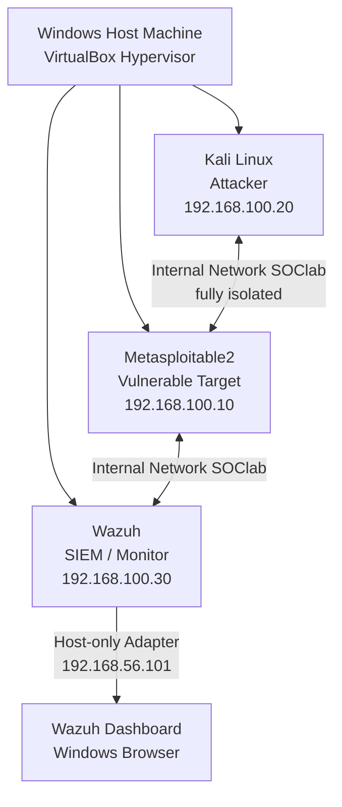

SOC Home Lab — Attack Detection & Investigation Practice

A fully isolated, self-built home lab for practicing SOC analyst skills: launching attacks, monitoring them with a real SIEM, and investigating alerts like an analyst would.
Built from scratch on a single 16GB RAM Windows machine — no cloud budget, no enterprise hardware, just VirtualBox and open-source security tools.

Why I Built This:
I'm working toward a career as a SOC Analyst and wanted hands-on experience beyond certificates and coursework. Reading about SIEM tools and attack detection only gets you so far — I wanted to actually launch an attack, watch it get detected, and practice the investigation workflow an analyst does every day.
This repo documents that build end-to-end: architecture, setup, configuration decisions, and the attack/detection walkthrough.

Lab Architecture:

Tools Used:
Tool	                  Role
VirtualBox	            Hypervisor running all three VMs
Kali Linux 2026.2	      Attacker machine — reconnaissance and exploitation
Metasploitable2	        Intentionally vulnerable target machine
Wazuh 4.14.7	          Open-source SIEM — log collection, alerting, and dashboard

Key Design Decisions:
Isolated internal network — all VMs communicate only with each other, never touching the real internet or home network, so attacks stay fully contained.
Dual-homed SIEM — the Wazuh VM has two network adapters: one on the isolated internal network (to receive logs from the attacker/target), and a separate host-only adapter purely for reaching its web dashboard from the host browser. This mirrors how a real SOC keeps monitoring infrastructure segmented from general access.
Resource-constrained by design — running on 16GB RAM meant deliberately right-sizing every VM (e.g., reducing Wazuh's default 8GB/4-core allocation down to 4GB/2-core) rather than assuming unlimited resources, which is a realistic constraint in many real environments too.

Setup Walkthrough
1. Hypervisor & Attacker Machine
Installed VirtualBox
Imported the official Kali Linux prebuilt VM
2. Vulnerable Target
Deployed Metasploitable2 (deliberately vulnerable Linux target)
Initial reconnaissance scan with nmap -sV revealed 21 open services, including several with known, documented vulnerabilities (outdated FTP, Telnet, Samba, and an intentionally exposed root shell)
3. Isolated Network
Configured a VirtualBox Internal Network ("SOClab") connecting Kali and Metasploitable2
Verified isolation and connectivity with static IP assignment and ping/nmap testing
4. SIEM Deployment
Deployed the official Wazuh OVA appliance
Configured dual network adapters (internal + host-only) for segmented monitoring access
Resolved service startup issues (wazuh-manager initially failed to start — diagnosed via systemctl status and resolved by manually starting the service)
Reset the dashboard admin credentials using Wazuh's built-in password tool after discovering the default credential file wasn't present at the documented path on this OVA version

(This section will be updated as I complete the agent installation, first attack simulation, and alert investigation.)

What's Next:
 Install Wazuh agents on Kali and Metasploitable2 to begin log collection
 Exploit a known Metasploitable2 vulnerability from Kali (e.g. vsftpd 2.3.4 backdoor)
 Capture and analyze the resulting Wazuh alert
 Document a full investigation write-up: indicators of compromise, timeline, and recommended remediation
 Map detected activity to MITRE ATT&CK techniques

About Me:
Aspiring SOC Analyst with a background in networking, VAPT, and a Google Cybersecurity certification. Building this lab to develop practical, hands-on detection and investigation skills.
